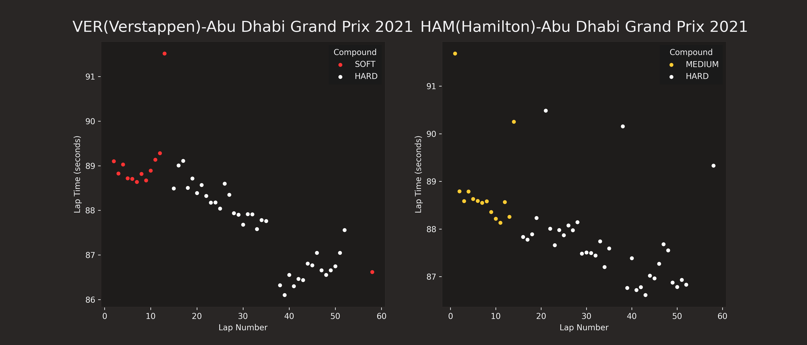

# F1 Lap Time Visualizer

Visualize Formula 1 lap times by tyre compound using the [FastF1](https://theoehrly.github.io/Fast-F1/) API and Matplotlib.  
Compare races, drivers, and tyre strategies from 2018–2024 with interactive prompts.

---

## Features
- **Single Race Mode** – Select a year, venue, and driver to see lap times in a scatter plot.
- **Two Race Mode** – Compare two drivers from different races side-by-side.
- **Tyre Compound Colors** – Matches official Pirelli colors (including historic Hypersoft/Ultrasoft/Supersoft).
- **Interactive Selection** – User chooses year, track, and driver code from available data.
- **Supports Historic & Modern Data** – Works with old compound names (Hypersoft, Ultrasoft, Supersoft) and current Soft/Medium/Hard.

---
## Requirements
- Python 3.8+
- fastf1
- matplotlib
- pandas

---

## Example Output
  
*Example: Verstappen vs Hamilton – Abu Dhabi Grand Prix 2021.*

---

## Installation
Clone this repository and install the required Python packages:

```bash
git clone https://github.com/YOUR_USERNAME/f1-lap-time-visualizer.git
cd f1-lap-time-visualizer
pip install -r requirements.txt
```
## Usage
To use just run this:
```bash
python Formula1LapTimeVisualiser.py
# or
python3 Formula1LapTimeVisualiser.py
```
- Then follow the prompts as listed
- *Notes: python and python3 can both be used, however depends on OS, (python3 for Mac or Linux, and python for Windows)

---

## License
This project is licensed under the [MIT License](LICENSE)
